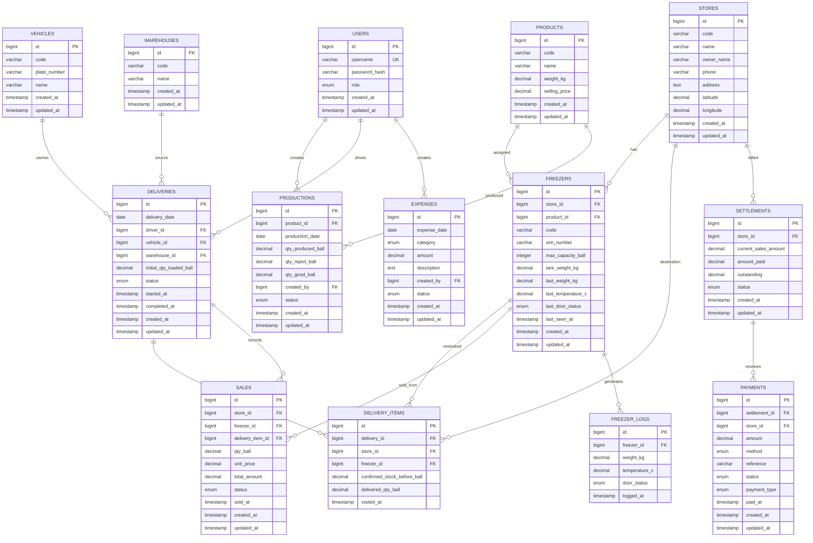

# Ice Factory Distribution MVP — Simplified Spec

**Scope:** Produksi es kristal, warehouse, delivery/restock, freezer outlet dengan IoT, sales & settlement, payment.

**Core Model:**
- 1 toko = 1+ freezer
- 1 freezer = perangkat IoT (load cell + temp + door sensor)
- IoT → weight (KG) → estimated stock (ball)
- Estimated stock = weight / product.weight_kg
- Settlement on delivery (driver collect at restock visit)

---

## 1. High-Level Flow

```text
PRODUCTION
    ↓
WAREHOUSE
    ↓
VEHICLE / DRIVER
    ↓
FREEZER AT STORE
    ↓
SOLD / DAMAGED
    ↓
SETTLEMENT
    ↓
PAYMENT
```

IoT flow:

```text
LOAD CELL + TEMP + DOOR SENSOR
            ↓
           ESP32
            ↓
      weight / temperature /
         door_status
            ↓
          BACKEND
            ↓
 estimated_stock_ball
            ↓
 suggested_delivery_ball
            ↓
            FE
```

Formula utama:

```text
estimated_stock_ball
= estimated_net_weight_kg / product.weight_kg

suggested_delivery_ball
= max_capacity_ball - estimated_stock_ball
```

Contoh:

```text
Product               = Es Kristal 10 KG
Freezer Max Capacity  = 10 ball
Estimated Stock       = 2 ball

Suggested Delivery
= 10 - 2
= 8 ball
```

---

## 2. Roles (Simplified)

```text
ADMIN       (full access)
WAREHOUSE   (production + inventory)
DRIVER      (delivery + sales + payment)
```

---

---

## 3. Database Schema (10 Tables)



---

---

## 4. Table Details

### 4.1 `users`
- `id`, `username` (UNIQUE), `password_hash`, `role` (ADMIN|WAREHOUSE|DRIVER), `created_at`

### 4.2 `stores`
- `id`, `code` (UNIQUE), `name`, `owner_name`, `phone`, `address`, `latitude`, `longitude`

### 4.3 `products`
- `id`, `code` (UNIQUE), `name`, `weight_kg`, `selling_price`
- Initial: ICE-10 / Es Kristal 10 KG / 10 kg / Rp10.000

### 4.4 `freezers`
- `id`, `store_id`, `product_id`, `code` (UNIQUE), `sim_number`, `max_capacity_ball`, `tare_weight_kg`
- `last_weight_kg`, `last_temperature_c`, `last_door_status` (OPEN|CLOSED), `last_seen_at`
- **1 toko = 1+ freezer** ✅
- **Real-time tracking:** Sensor pintu + weight change = aktivitas penjualan/restock
- Digunakan untuk identify jam-jam ramai & optimize delivery timing

### 4.5 Stock Calculation (On-the-fly)
```text
net_weight_kg = last_weight_kg - tare_weight_kg
estimated_stock_ball = ROUND(net_weight_kg / product.weight_kg)
estimated_stock_ball = MAX(0, MIN(max_capacity_ball, result))
suggested_delivery = max_capacity_ball - estimated_stock_ball
```

### 4.6 `warehouses`, `vehicles`
- Warehouse: `id`, `code`, `name`
- Vehicle: `id`, `code`, `plate_number`, `name`

### 4.7 `productions`
- `id`, `product_id`, `production_date`, `qty_produced_ball`, `qty_reject_ball`, `qty_good_ball`, `created_by`, `status` (DRAFT|POSTED|CANCELLED)
- Formula: `qty_good_ball = qty_produced_ball - qty_reject_ball`
- **Production staff hanya track output, bukan cost** ✅
- Semua biaya (mesin, perawatan, packing, listrik, dll) di-track di EXPENSES table per bulan

### 4.8 `deliveries`
- `id`, `delivery_date`, `driver_id`, `vehicle_id`, `warehouse_id`, `initial_qty_loaded_ball`, `status` (PLANNED|COMPLETED|CANCELLED), `started_at`, `completed_at`
- **`initial_qty_loaded_ball`** = Qty yang dimuat dari warehouse (audit trail awal) ✅
- Track jam-jam delivery untuk optimize timing sebelum jam puncak penjualan
- Verify sisa: `initial_qty_loaded_ball - SUM(delivery_items.delivered_qty_ball where delivery_id = X)`

### 4.9 `delivery_items` (1 row = 1 freezer visited) — MINIMAL FIELDS
- `id`, `delivery_id`, `store_id`, `freezer_id`, `confirmed_stock_before_ball`, `delivered_qty_ball`, `visited_at`
- **Driver only input 2 things:** stok sebelumnya + qty deliver (minimize error!) ✅
- `stock_after = confirmed_before + delivered_qty` (auto-calculated)
- `visited_at` = sistem timestamp (auto-generated saat driver confirm)

### 4.10 `sales`
- `id`, `store_id`, `freezer_id`, `delivery_item_id`, `qty_ball`, `unit_price`, `total_amount`, `status` (CONFIRMED|VOID), `sold_at`
- **`qty_ball = stock_after_previous - confirmed_stock_before`**

### 4.11 `settlements`
- `id`, `store_id`, `current_sales_amount`, `amount_paid`, `outstanding`, `status` (DRAFT|COMPLETED|VOID)
- Auto-aggregate sales dari semua freezer toko saat driver visit

### 4.12 `payments`
- `id`, `settlement_id`, `store_id`, `amount`, `method` (CASH|TRANSFER|QRIS), `reference`, `status` (CONFIRMED|VOID), `payment_type` (TODAY|PAST_DAYS|DEBT), `paid_at`

### 4.13 `expenses`
- `id`, `expense_date`, `category` (FUEL|SALARY|ELECTRICITY|PACKAGING|MAINTENANCE|OTHER), `amount`, `description`, `created_by`, `status`
- **Source of truth semua biaya operasional** ✅
- Track perbulan: listrik, gaji, packing, bensin, maintenance mesin, maintenance kendaraan, dll

### 4.14 `freezer_logs` (IoT Sensor Data - Operational Intelligence)
- `id`, `freezer_id`, `weight_kg`, `temperature_c`, `door_status` (OPEN|CLOSED), `logged_at` (timestamp)
- **BUKAN untuk pencatatan penjualan** ⚠️
- **Hanya untuk operational intelligence:** Detect jam-jam ramai
- IoT push ke backend setiap event perubahan weight/door
- Driver TIDAK perlu lihat data ini saat konfirmasi
- Data ini untuk: plan delivery sebelum jam puncak, detect anomali

---

## 6. Warehouse Stock (on-the-fly calculation)
```text
SUM(productions.qty_good_ball where status=POSTED)
- SUM(delivery_items.delivered_qty_ball)
```

## 7. Vehicle Stock
```text
SUM(delivery_items.delivered_qty_ball where vehicle loaded)
- SUM(delivery_items.delivered_qty_ball where freezer restocked)
```

## 8. Real-time Monitoring vs Actual Sales Record

**Dua Data Source Berbeda:**

```
FREEZER_LOGS (IoT Sensor → Real-time, untuk planning)
├─ Source: Door sensor + weight sensor
├─ Akurasi: ±90% (edge case ada)
├─ Tujuan: Detect jam ramai, optimize delivery timing
├─ User: Planner/Admin dashboard
└─ Data: weight_kg, temperature_c, door_status, logged_at

SALES (Driver Confirmation → Final record, untuk finansial)
├─ Source: Driver physical check + confirmation
├─ Akurasi: 100% (confirmed by human)
├─ Tujuan: Financial transaction record
├─ User: Admin/Finance untuk settlement & payment
└─ Data: qty_ball, unit_price, total_amount, sold_at
```

**Timeline Operasional:**

```text
SEBELUM DELIVERY (Monitoring)
├─ FREEZER_LOGS collect real-time: weight turun = laku, door buka = ramai
├─ Dashboard show: "RSA-001 jam 11-2PM sering ada aktivitas"
├─ Planner: "OK, kirim RSA-001 jam 10AM sebelum jam ramai"
└─ Schedule di DELIVERIES

SAAT DRIVER TIBA (Konfirmasi & Pencatatan)
├─ Driver TIDAK perlu lihat FREEZER_LOGS
├─ Driver: Physical check "Stok sekarang berapa?"
├─ Driver restock: "Tadi 5 ball, saya kasih 3 ball"
├─ System: Create SALES record (final, akurat 100%)
└─ FREEZER_LOGS update: weight naik (ada restock)
```

**Contoh Perbedaan:**

| Event | FREEZER_LOGS | SALES Record |
|-------|--------------|--------------|
| Jam 12 siang | weight ↓ 2 kg (estimate 0.2 ball laku) | - (belum ada driver) |
| Jam 1 siang | weight ↓ 5 kg lagi (estimate 0.5 ball laku) | - (belum ada driver) |
| Jam 11 pagi (H+1) | driver tiba | Driver confirm: "Sebelumnya 5 ball, sekarang 2 ball, jadi laku 3 ball" |
| | FREEZER_LOGS: data historical | SALES: qty=3, sold_at=2026-08-21 11:05 |

**Key Point:** ✅
- FREEZER_LOGS = Untuk smart delivery planning
- SALES = Untuk accounting & settlement
- Tidak mixing-aduk, data source tetap terpisah

---

## 9. Driver Flow — CONFIRM-BASED (99% 1-CLICK)

**Dashboard per toko, per freezer:**
```
BEFORE DRIVER VISIT (IoT Smart Suggestion)
├─ Freezer A:
│  ├─ Estimated stock (from IoT): 2 ball
│  ├─ Suggested delivery: 8 ball (max 10 - est 2)
│  └─ Button: "Confirm stok 2 ball?" [YA] [TIDAK]
│
├─ Freezer B:
│  ├─ Estimated stock: 0 ball
│  ├─ Suggested delivery: 10 ball
│  └─ Button: "Confirm stok 0 ball?" [YA] [TIDAK]
│
└─ Freezer C:
   ├─ Estimated stock: 4 ball
   ├─ Suggested delivery: 6 ball
   └─ Button: "Confirm stok 4 ball?" [YA] [TIDAK]
```

**Driver Workflow (MINIMAL ACTION):**

```
TYPICAL CASE (95%):
├─ Freezer A: Klik [YA]
│  └─ Auto-fill: confirmed_before = 2, delivered_qty = 8 ✅
├─ Freezer B: Klik [YA]
│  └─ Auto-fill: confirmed_before = 0, delivered_qty = 10 ✅
└─ Freezer C: Klik [YA]
   └─ Auto-fill: confirmed_before = 4, delivered_qty = 6 ✅
   RESULT: 3 freezer selesai, 3 klik doang!

EDGE CASE (5%):
└─ Freezer D: Klik [TIDAK]
   ├─ "Stok sebenarnya berapa?" → Driver ketik: 3
   ├─ "Kasih berapa?" → System suggest: 7 (10-3)
   ├─ Driver confirm: [YA]
   └─ Auto-fill: confirmed_before = 3, delivered_qty = 7 ✅
```

**Key Benefits:**
- **95% case = 1 klik per freezer** (confirm)
- **5% case = 2-3 input** (manual override only)
- **ZERO calculation error** (system auto-calculate)
- **ZERO miss data** (suggested values ketrack clear)
- **AUDIT TRAIL COMPLETE** (dari awal sampai akhir)

---

## 9.1 Payment Model — FLEXIBLE (3 OPSI)

**Pembayaran driver bisa dipilih sesuai kebutuhan (pencatatan tetap jelas):**

```
MODEL A: INSTANT PAYMENT
├─ Tanggal 1: Driver antar 10 ball
├─ Langsung: Bayar 10 × harga per ball (CASH at delivery)
└─ Status: PAID (PAYMENTS.status = CONFIRMED)

MODEL B: SETTLEMENT PAYMENT (Akurat)
├─ Tanggal 1: Driver antar 10 ball → catat
├─ Tanggal 2: Sisa 2 ball → yang 8 habis
├─ Bayar: 8 × harga per ball saat next visit
└─ Status: PAID (PAYMENTS.status = CONFIRMED)

MODEL C: PENDING PAYMENT (Flexible)
├─ Tanggal 1: Driver antar 10 ball → catat di SALES
├─ Tanggal 2-5: Belum bayar
├─ OUTSTANDING: 10 × harga per ball (terlihat di dashboard)
└─ Tanggal 6: Bayar sekaligus 2-3 hari → PAYMENTS.status = CONFIRMED
```

**Key: OUTSTANDING Tracking Jelas**
```
SETTLEMENTS:
├─ current_sales_amount = total SUM(SALES) per toko
├─ amount_paid = total SUM(PAYMENTS CONFIRMED) 
└─ outstanding = current_sales_amount - amount_paid

Driver/Toko lihat: "Outstanding Rp X masih belum dibayar" ✅
```

**Workflow sama untuk 3 model:**
```
Delivery → Create SALES (qty & amount jelas)
       ↓
Kapan bayar? (flexible: langsung/besok/nanti)
       ↓
PAYMENTS record (saat terjadi pembayaran)
       ↓
OUTSTANDING auto-update (current_sales - paid_amount)
```

**Default MVP: MODEL A** (Simple & instant)
- Tapi sistem support ketiga model, tinggal pilih saat payment

---

## 10. Revenue & Collection

**Audit Trail (dari data yang simple tadi):**
```
DELIVERIES.initial_qty_loaded_ball = 10 ball (awal hari)
    ↓
DELIVERY_ITEMS per stop:
- Stop 1: deliver 3 → stok toko: 5→8
- Stop 2: deliver 5 → stok toko: 2→7  
- Stop 3: deliver 2 → stok toko: 0→2
    ↓
Sisa driver: 10 - (3+5+2) = 0 ✅ (balanced, no data miss)
```

**Revenue Calculation:**
```text
SUM(sales.total_amount where status = CONFIRMED)
```

**Collection:**
```text
SUM(payments.amount where status = CONFIRMED)
```

**Outstanding:**
```text
Revenue - Collection (per store)
```

**Net Profit:**
```text
Revenue - SUM(expenses)

Note: Production tracking hanya qty, cost tracking terpisah di EXPENSES
Breakdown biaya bulanan:
- Listrik, air, gas
- Mesin & perawatan
- Packing plastik
- Gaji karyawan
- Bensin/maintenance kendaraan
dll
```

---

## 11. MVP Checklist

- ✅ 10 tables (lean & focused)
- ✅ 1 toko = 1+ freezer
- ✅ IoT → weight → estimated stock
- ✅ Driver confirm → auto-calculate sold
- ✅ Settlement on delivery
- ✅ Cash/transfer payment
- ✅ Simple expense tracking
- ✅ Revenue / collection / profit calc
- ❌ Cash handover (phase 2)
- ❌ Stock movements table (redundant)
- ❌ Sensor readings table (simplify to freezers.last_*)
- ❌ 5 roles (simplify to 3: ADMIN/WAREHOUSE/DRIVER)
