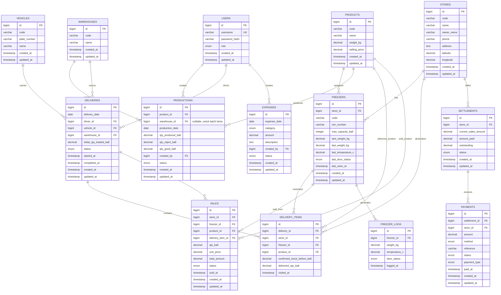

# Ice Factory Distribution MVP — Simplified Spec

**Scope:** Produksi es kristal, warehouse, delivery/restock, freezer outlet dengan IoT, sales & settlement, payment.

**Core Model:**
- 1 toko = 1+ freezer
- 1 freezer = perangkat IoT (load cell + temp + door sensor)
- IoT → weight (KG) → estimated stock (ball)
- Estimated stock = weight / product.weight_kg
- Settlement on delivery (driver collect at restock visit)

---

## 1. High-Level Flow

```text
PRODUCTION
    ↓
WAREHOUSE
    ↓
VEHICLE / DRIVER
    ↓
FREEZER AT STORE
    ↓
SOLD / DAMAGED
    ↓
SETTLEMENT
    ↓
PAYMENT
```

IoT flow:

```text
LOAD CELL + TEMP + DOOR SENSOR
            ↓
           ESP32
            ↓
      weight / temperature /
         door_status
            ↓
          BACKEND
            ↓
 estimated_stock_ball
            ↓
 suggested_delivery_ball
            ↓
            FE
```

Formula utama:

```text
estimated_stock_ball
= estimated_net_weight_kg / product.weight_kg

suggested_delivery_ball
= max_capacity_ball - estimated_stock_ball
```

Contoh:

```text
Product               = Es Kristal 10 KG
Freezer Max Capacity  = 10 ball
Estimated Stock       = 2 ball

Suggested Delivery
= 10 - 2
= 8 ball
```

---

## 2. Roles (Simplified)

```text
ADMIN       (full access)
WAREHOUSE   (production + inventory)
DRIVER      (delivery + sales + payment)
```

---

---

## 3. Database Schema (10 Tables)


```mermaid
erDiagram

    USERS {
        bigint id PK
        varchar username UK
        varchar password_hash
        enum role
        timestamp created_at
        timestamp updated_at
    }

    STORES {
        bigint id PK
        varchar code
        varchar name
        varchar owner_name
        varchar phone
        text address
        decimal latitude
        decimal longitude
        timestamp created_at
        timestamp updated_at
    }

    PRODUCTS {
        bigint id PK
        varchar code
        varchar name
        decimal weight_kg
        decimal selling_price
        timestamp created_at
        timestamp updated_at
    }

    FREEZERS {
        bigint id PK
        bigint store_id FK
        varchar code
        varchar sim_number
        integer max_capacity_ball
        decimal tare_weight_kg
        decimal last_weight_kg
        decimal last_temperature_c
        enum last_door_status
        timestamp last_seen_at
        timestamp created_at
        timestamp updated_at
    }

    WAREHOUSES {
        bigint id PK
        varchar code
        varchar name
        timestamp created_at
        timestamp updated_at
    }

    VEHICLES {
        bigint id PK
        varchar code
        varchar plate_number
        varchar name
        timestamp created_at
        timestamp updated_at
    }

    PRODUCTIONS {
        bigint id PK
        bigint product_id FK
        bigint warehouse_id FK "nullable, untuk batch lama"
        date production_date
        decimal qty_produced_ball
        decimal qty_reject_ball
        decimal qty_good_ball
        bigint created_by FK
        enum status
        timestamp created_at
        timestamp updated_at
    }

    DELIVERIES {
        bigint id PK
        date delivery_date
        bigint driver_id FK
        bigint vehicle_id FK
        bigint warehouse_id FK
        decimal initial_qty_loaded_ball
        enum status
        timestamp started_at
        timestamp completed_at
        timestamp created_at
        timestamp updated_at
    }

    DELIVERY_ITEMS {
        bigint id PK
        bigint delivery_id FK
        bigint store_id FK
        bigint freezer_id FK
        bigint product_id FK
        decimal confirmed_stock_before_ball
        decimal delivered_qty_ball
        timestamp visited_at
    }

    SALES {
        bigint id PK
        bigint store_id FK
        bigint freezer_id FK
        bigint product_id FK
        bigint delivery_item_id FK
        decimal qty_ball
        decimal unit_price
        decimal total_amount
        enum status
        timestamp sold_at
        timestamp created_at
        timestamp updated_at
    }

    SETTLEMENTS {
        bigint id PK
        bigint store_id FK
        decimal current_sales_amount
        decimal amount_paid
        decimal outstanding
        enum status
        timestamp created_at
        timestamp updated_at
    }

    PAYMENTS {
        bigint id PK
        bigint settlement_id FK
        bigint store_id FK
        decimal amount
        enum method
        varchar reference
        enum status
        enum payment_type
        timestamp paid_at
        timestamp created_at
        timestamp updated_at
    }

    EXPENSES {
        bigint id PK
        date expense_date
        enum category
        decimal amount
        text description
        bigint created_by FK
        enum status
        timestamp created_at
        timestamp updated_at
    }

    FREEZER_LOGS {
        bigint id PK
        bigint freezer_id FK
        decimal weight_kg
        decimal temperature_c
        enum door_status
        timestamp logged_at
    }

    STORES ||--o{ FREEZERS : has
    PRODUCTS ||--o{ FREEZERS : assigned
    PRODUCTS ||--o{ PRODUCTIONS : produced
    USERS ||--o{ PRODUCTIONS : creates
    USERS ||--o{ DELIVERIES : drives
    VEHICLES ||--o{ DELIVERIES : carries
    WAREHOUSES ||--o{ PRODUCTIONS : holds
    WAREHOUSES ||--o{ DELIVERIES : source
    DELIVERIES ||--o{ DELIVERY_ITEMS : contains
    STORES ||--o{ DELIVERY_ITEMS : destination
    FREEZERS ||--o{ DELIVERY_ITEMS : restocked
    PRODUCTS ||--o{ DELIVERY_ITEMS : delivered_product
    DELIVERIES ||--o{ SALES : records
    FREEZERS ||--o{ SALES : sold_from
    PRODUCTS ||--o{ SALES : sold_product
    STORES ||--o{ SETTLEMENTS : billed
    SETTLEMENTS ||--o{ PAYMENTS : receives
    USERS ||--o{ EXPENSES : creates
    FREEZERS ||--o{ FREEZER_LOGS : generates
```

---

---

## 4. Table Details

### 4.1 `users`
- `id`, `username` (UNIQUE), `password_hash`, `role` (ADMIN|WAREHOUSE|DRIVER), `created_at`

### 4.2 `stores`
- `id`, `code` (UNIQUE), `name`, `owner_name`, `phone`, `address`, `latitude`, `longitude`

### 4.3 `products`
- `id`, `code` (UNIQUE), `name`, `weight_kg`, `selling_price`
- Initial: ICE-10 / Es Kristal 10 KG / 10 kg / Rp10.000

### 4.4 `freezers`
- `id`, `store_id`, `code` (UNIQUE), `sim_number`, `max_capacity_ball`, `tare_weight_kg`
- `last_weight_kg`, `last_temperature_c`, `last_door_status` (OPEN|CLOSED), `last_seen_at`
- **Tidak ada `product_id`:** satu kulkas boleh berisi beberapa produk. Produk apa saja yang
  pernah dikirim ke sana diturunkan dari `delivery_items`, bukan disimpan di kulkas, supaya hanya
  ada satu sumber kebenaran ✅
- `max_capacity_ball` desimal: 1 ball = 10 kg, jadi kulkas 7.5 ball menampung 75 kg
- **1 toko = 1+ freezer** ✅
- **Real-time tracking:** Sensor pintu + weight change = aktivitas penjualan/restock
- Digunakan untuk identify jam-jam ramai & optimize delivery timing

### 4.5 Stock Calculation (On-the-fly)
```text
BALL_KG = 10   # satuan tetap, bukan berat produk

net_weight_kg = last_weight_kg - tare_weight_kg
estimated_stock_ball = net_weight_kg / 10
estimated_stock_ball = MAX(0, MIN(max_capacity_ball, ROUND(result, 2)))
suggested_delivery = max_capacity_ball - estimated_stock_ball
```

Pembagi selalu 10 kg, bukan `product.weight_kg`. Ball adalah satuan berat, bukan benda fisik,
jadi produk 10 kg = 1 ball, 15 kg = 1,5 ball, 5 kg = 0,5 ball dengan satu kolom angka.

Karena kulkas bisa berisi beberapa produk, angka ini adalah **total** isi kulkas. Sensor tidak
tahu komposisinya, jadi hasil ini tidak pernah dipecah per produk secara otomatis ✅

### 4.6 `warehouses`, `vehicles`
- Warehouse: `id`, `code`, `name`
- Vehicle: `id`, `code`, `plate_number`, `name`

### 4.7 `productions`
- `id`, `product_id`, `warehouse_id`, `production_date`, `qty_produced_ball`, `qty_reject_ball`, `qty_good_ball`, `created_by`, `status` (DRAFT|POSTED|CANCELLED)
- Formula: `qty_good_ball = qty_produced_ball - qty_reject_ball`
- `warehouse_id` nullable, wajib diisi saat membuat batch baru. Batch lama yang tidak punya gudang
  dilaporkan terpisah lewat `unassigned_production_qty`, bukan diatribusikan ke gudang mana pun.
- **Production staff hanya track output, bukan cost** ✅
- Semua biaya (mesin, perawatan, packing, listrik, dll) di-track di EXPENSES table per bulan

### 4.8 `deliveries`
- `id`, `delivery_date`, `driver_id`, `vehicle_id`, `warehouse_id`, `initial_qty_loaded_ball`, `collection_target`, `status` (PLANNED|COMPLETED|CANCELLED), `started_at`, `completed_at`
- **`initial_qty_loaded_ball`** = Qty yang dimuat dari warehouse (audit trail awal) ✅
  - **`collection_target`** = Target penagihan rupiah untuk pengiriman ini (BRD §2.2 "Target
    collection: Rp 500K"). Nullable — rute tetap sah tanpa target
  - Catatan scope: BRD memakai nama `collection_target` untuk dua hal berbeda. Yang di sini
    milik satu pengiriman (BRD §2.3, dashboard driver, berdampingan dengan "Stops: 5 toko").
    Yang di `GET /api/dashboard/summary` (BRD §2.1 "Target collection: Rp 1.5M") adalah target
    harian perusahaan dan belum ada di kode — `DashboardController@getSummary` belum
    mengembalikannya, dan BRD tidak menyebut dari mana angka itu disimpan
- `warehouses` punya `latitude`/`longitude` nullable karena urutan rute dihitung dari gudang asal
- Track jam-jam delivery untuk optimize timing sebelum jam puncak penjualan
- Verify sisa: `initial_qty_loaded_ball - SUM(delivery_items.delivered_qty_ball where delivery_id = X)`

### 4.8.1 `delivery_stops` (1 row = 1 toko yang direncanakan dikunjungi) — BARU
- `id`, `delivery_id`, `store_id`, `sequence`, `planned_qty_ball`, `status` (PENDING|VISITED|SKIPPED), `visited_at`, `notes`
- ** Kenapa tabel ini perlu:** sebelumnya rencana pengiriman tidak menyimpan sama sekali ke mana
  driver harus pergi. `store_id` hanya muncul setelah driver sudah berada di depan toko itu
  (`delivery_items`), sehingga tidak ada yang bisa bilang "driver ini seharusnya ke mana" saat
  delivery masih berjalan. BRD §2.2 menetapkan `Stores: [...] [MULTI-SELECT]` saat pembuatan
  rencana, dan §2.3 menampilkan "Stops: 5 toko" beserta urutan kunjungan
- **`sequence`** = urutan kunjungan mulai 1, dihitung otomatis nearest-first dari gudang asal
  (nearest-neighbour), bukan urutan ketik. BRD: "Auto-sort by optimal route (nearest first)"
  - Constraint unik `delivery_id + store_id` (satu toko dikunjungi sekali per pengiriman) dan
    `delivery_id + sequence` (urutan rute tidak boleh bentrok)
  - `planned_qty_ball` nullable dan sifatnya saran, bukan instruksi muat — sensor hanya tahu total
    kilogram per freezer, dan satu freezer bisa berisi beberapa produk, sehingga pembagian per
    produk tidak bisa diturunkan dari IoT
  - **`arrived_at`, `departed_at`** = kapan driver tiba dan meninggalkan toko. BRD §2.3
    memandangnya dua langkah terpisah ("ARRIVE AT STOP #1" lalu adegan di toko), sedangkan
    sebelumnya satu-satunya cara menutup stop adalah konfirmasi freezer. Akibatnya toko yang
    didatangi lalu tidak ada yang dibeli tidak bisa ditutup sama sekali, dan `stops_completed`
    melaporkan angka yang lebih kecil dari kenyataan. Dua timestamp lebih jujur daripada
   	status keempat, dan tidak perlu mengubah enum yang sudah ada
  - `status` berubah ke `VISITED` pada konfirmasi freezer pertama, atau saat driver leave dari
    stop yang punya minimal satu baris konfirmasi. Stop yang ditinggali tanpa barang **tidak**
    ditandai `VISITED` — tidak ada barang di sana, dan menandai begitu berarti berbohong
  - Konfirmasi barang juga mencatat `arrived_at` bila belum ada: driver yang melewati layar
    tiba tetap sedang berdiri di toko itu, jadi stop tidak boleh terbaca belum dikunjungi
  - Toko tanpa koordinat tetap masuk rencana, tetapi jaraknya tidak bisa dihitung dan dilaporkan
    `leg_km: null` — lebih baik daripada menebak posisi
  - Driver hanya bisa konfirmasi di toko yang ada di rutenya; delivery tanpa stop (rencana lama)
    tetap permisif agar data lama tidak terkunci
  - `status = SKIPPED` diisi lewat endpoint `skip` dengan `reason` wajib, karena reasons yang
    membedakan toko tutup dari toko tidak bisa dilayani
  - `GET .../settlement-preview` per stop: `outstanding_before_this_stop` (utang **sebelum**
    kunjungan, hanya sales yang sudah di-approve) + `this_visit_sales` = `payable_today`. Sales
    di stop ini masih `PENDING`, jadi belum jadi utang — kalau dihitung dua kali, preview akan
    berbeda dengan saldo toko begitu pembayaran masuk
  - Sales cari lewat `delivery_item_id`, bukan langsung ke delivery, supaya penjualan run
    sebelumnya di toko yang sama tidak ikut terhitung sebagai hasil kunjungan ini

### 4.9 `delivery_items` (1 row = 1 pasangan freezer + produk per kunjungan) — MINIMAL FIELDS
- `id`, `delivery_id`, `store_id`, `freezer_id`, `product_id`, `confirmed_stock_before_ball`, `delivered_qty_ball`, `visited_at`
- **Driver only input 3 things:** produk + stok sebelumnya + qty deliver (minimize error!) ✅
- `product_id` ada di sini, bukan di `freezers`, karena satu kulkas bisa berisi beberapa produk
- Constraint unik per pasangan freezer/produk: produk yang sama tidak boleh diulang untuk kulkas
  yang sama dalam satu delivery
- `stock_after = confirmed_before + delivered_qty` (auto-calculated)
- `visited_at` = sistem timestamp (auto-generated saat driver confirm)

### 4.10 `sales`
- `id`, `store_id`, `freezer_id`, `product_id`, `delivery_item_id`, `qty_ball`, `unit_price`, `total_amount`, `status` (PENDING|CONFIRMED|VOID), `sold_at`
- `product_id` wajib: tiap produk punya harga sendiri, jadi es 15 kg tidak boleh dihitung dengan
  harga es 10 kg
- **`qty_ball` dicatat driver per produk, bukan diturunkan dari selisih sensor.** Kulkas bisa
  berisi beberapa produk dan sensor hanya melaporkan satu angka total isi kulkas, sehingga selisih
  total tidak bisa diatribusikan ke produk tertentu ✅
- `unit_price` diambil dari `products.selling_price` di server, bukan dari request, sehingga produk
  yang sama tidak bisa terjual dengan dua harga berbeda
- `total_amount = qty_ball × unit_price`, disimpan pada presisi penuh (tidak dibulatkan)
- `status`: `PENDING` saat driver mencatat, `CONFIRMED` setelah admin menyetujui, `VOID` jika
  ditolak. Baris yang ditolak tetap disimpan untuk jejak audit
- Hanya `CONFIRMED` yang masuk settlement, outstanding, dan total pendapatan
- Constraint: `product_id` harus sudah pernah ada di `delivery_items` untuk freezer dan delivery
  yang sama

### 4.11 `settlements`
- `id`, `store_id`, `current_sales_amount`, `amount_paid`, `outstanding`, `status` (DRAFT|COMPLETED|VOID)
- Auto-aggregate sales dari semua freezer toko saat driver visit

### 4.12 `payments`
- `id`, `settlement_id`, `store_id`, `amount`, `method` (CASH|TRANSFER|QRIS), `reference`, `status` (CONFIRMED|VOID), `payment_type` (TODAY|PAST_DAYS|DEBT), `paid_at`

### 4.13 `expenses`
- `id`, `expense_date`, `category` (FUEL|SALARY|ELECTRICITY|PACKAGING|MAINTENANCE|OTHER), `amount`, `description`, `created_by`, `status`
- **Source of truth semua biaya operasional** ✅
- Track perbulan: listrik, gaji, packing, bensin, maintenance mesin, maintenance kendaraan, dll

### 4.14 `freezer_logs` (IoT Sensor Data - Operational Intelligence)
- `id`, `freezer_id`, `weight_kg`, `temperature_c`, `door_status` (OPEN|CLOSED), `logged_at` (timestamp)
- **BUKAN untuk pencatatan penjualan** ⚠️
- **Hanya untuk operational intelligence:** Detect jam-jam ramai
- IoT push ke backend setiap event perubahan weight/door
- Driver TIDAK perlu lihat data ini saat konfirmasi
- Data ini untuk: plan delivery sebelum jam puncak, detect anomali

---

## 6. Warehouse Stock (on-the-fly calculation)
```text
SUM(productions.qty_good_ball where status=POSTED and productions.warehouse_id = :id)
- SUM(delivery_items.delivered_qty_ball
      where deliveries.warehouse_id = :id and deliveries.status != 'CANCELLED')
```

Kedua sisi wajib di-scope ke gudang yang sama. Versi sebelumnya menjumlah seluruh tabel `productions`
sambil menerima `warehouse_id` sebagai argumen, sehingga id itu tidak pernah masuk ke query: semua
gudang melaporkan angka yang sama, dan delivery bisa lolos dari gudang yang stoknya kosong.

Batch dengan `warehouse_id` NULL tidak masuk ke mana pun; jumlahnya dikembalikan terpisah sebagai
`unassigned_production_qty` supaya terlihat tanpa perlu menebak asal-usulnya.

Implementasi tunggal: `app/Services/WarehouseStockService.php` (dipakai model, controller gudang,
dan controller delivery) supaya ketiga pemanggil tidak bisa berbeda rumus.

## 7. Vehicle Stock
```text
SUM(delivery_items.delivered_qty_ball where vehicle loaded)
- SUM(delivery_items.delivered_qty_ball where freezer restocked)
```

## 8. Real-time Monitoring vs Actual Sales Record

**Dua Data Source Berbeda:**

```
FREEZER_LOGS (IoT Sensor → Real-time, untuk planning)
├─ Source: Door sensor + weight sensor
├─ Akurasi: ±90% (edge case ada)
├─ Tujuan: Detect jam ramai, optimize delivery timing
├─ User: Planner/Admin dashboard
└─ Data: weight_kg, temperature_c, door_status, logged_at

SALES (Driver Confirmation → Final record, untuk finansial)
├─ Source: Driver physical check + confirmation
├─ Akurasi: 100% (confirmed by human)
├─ Tujuan: Financial transaction record
├─ User: Admin/Finance untuk settlement & payment
└─ Data: qty_ball, unit_price, total_amount, sold_at
```

**Timeline Operasional:**

```text
SEBELUM DELIVERY (Monitoring)
├─ FREEZER_LOGS collect real-time: weight turun = laku, door buka = ramai
├─ Dashboard show: "RSA-001 jam 11-2PM sering ada aktivitas"
├─ Planner: "OK, kirim RSA-001 jam 10AM sebelum jam ramai"
└─ Schedule di DELIVERIES

SAAT DRIVER TIBA (Konfirmasi & Pencatatan)
├─ Driver TIDAK perlu lihat FREEZER_LOGS
├─ Driver: Physical check "Stok sekarang berapa?"
├─ Driver restock: "Tadi 5 ball, saya kasih 3 ball"
├─ System: Create SALES record (final, akurat 100%)
└─ FREEZER_LOGS update: weight naik (ada restock)
```

**Contoh Perbedaan:**

| Event | FREEZER_LOGS | SALES Record |
|-------|--------------|--------------|
| Jam 12 siang | weight ↓ 2 kg (estimate 0.2 ball laku) | - (belum ada driver) |
| Jam 1 siang | weight ↓ 5 kg lagi (estimate 0.5 ball laku) | - (belum ada driver) |
| Jam 11 pagi (H+1) | driver tiba | Driver confirm: "Sebelumnya 5 ball, sekarang 2 ball, jadi laku 3 ball" |
| | FREEZER_LOGS: data historical | SALES: qty=3, sold_at=2026-08-21 11:05 |

**Key Point:** ✅
- FREEZER_LOGS = Untuk smart delivery planning
- SALES = Untuk accounting & settlement
- Tidak mixing-aduk, data source tetap terpisah

---

## 9. Driver Flow — CONFIRM-BASED (99% 1-CLICK)

**Dashboard per toko, per freezer:**
```
BEFORE DRIVER VISIT (IoT Smart Suggestion)
├─ Freezer A:
│  ├─ Estimated stock (from IoT): 2 ball
│  ├─ Suggested delivery: 8 ball (max 10 - est 2)
│  └─ Button: "Confirm stok 2 ball?" [YA] [TIDAK]
│
├─ Freezer B:
│  ├─ Estimated stock: 0 ball
│  ├─ Suggested delivery: 10 ball
│  └─ Button: "Confirm stok 0 ball?" [YA] [TIDAK]
│
└─ Freezer C:
   ├─ Estimated stock: 4 ball
   ├─ Suggested delivery: 6 ball
   └─ Button: "Confirm stok 4 ball?" [YA] [TIDAK]
```

**Driver Workflow (MINIMAL ACTION):**

```
TYPICAL CASE (95%):
├─ Freezer A: Klik [YA]
│  └─ Auto-fill: confirmed_before = 2, delivered_qty = 8 ✅
├─ Freezer B: Klik [YA]
│  └─ Auto-fill: confirmed_before = 0, delivered_qty = 10 ✅
└─ Freezer C: Klik [YA]
   └─ Auto-fill: confirmed_before = 4, delivered_qty = 6 ✅
   RESULT: 3 freezer selesai, 3 klik doang!

EDGE CASE (5%):
└─ Freezer D: Klik [TIDAK]
   ├─ "Stok sebenarnya berapa?" → Driver ketik: 3
   ├─ "Kasih berapa?" → System suggest: 7 (10-3)
   ├─ Driver confirm: [YA]
   └─ Auto-fill: confirmed_before = 3, delivered_qty = 7 ✅
```

**Key Benefits:**
- **95% case = 1 klik per freezer** (confirm)
- **5% case = 2-3 input** (manual override only)
- **ZERO calculation error** (system auto-calculate)
- **ZERO miss data** (suggested values ketrack clear)
- **AUDIT TRAIL COMPLETE** (dari awal sampai akhir)

Untuk kulkas multi-produk, konfirmasi diulang per produk dan penjualan dicatat terpisah per
produk. Driver tidak pernah menghitung dari sensor, sehingga tidak ada selisih yang harus
ditebak sendiri.

---

## 9.1 Payment Model — FLEXIBLE (3 OPSI)

**Pembayaran driver bisa dipilih sesuai kebutuhan (pencatatan tetap jelas):**

```
MODEL A: INSTANT PAYMENT
├─ Tanggal 1: Driver antar 10 ball
├─ Langsung: Bayar 10 × harga per ball (CASH at delivery)
└─ Status: PAID (PAYMENTS.status = CONFIRMED)

MODEL B: SETTLEMENT PAYMENT (Akurat)
├─ Tanggal 1: Driver antar 10 ball → catat
├─ Tanggal 2: Sisa 2 ball → yang 8 habis
├─ Bayar: 8 × harga per ball saat next visit
└─ Status: PAID (PAYMENTS.status = CONFIRMED)

MODEL C: PENDING PAYMENT (Flexible)
├─ Tanggal 1: Driver antar 10 ball → catat di SALES
├─ Tanggal 2-5: Belum bayar
├─ OUTSTANDING: 10 × harga per ball (terlihat di dashboard)
└─ Tanggal 6: Bayar sekaligus 2-3 hari → PAYMENTS.status = CONFIRMED
```

**Key: OUTSTANDING Tracking Jelas**
```
SETTLEMENTS:
├─ current_sales_amount = total SUM(SALES) per toko
├─ amount_paid = total SUM(PAYMENTS CONFIRMED) 
└─ outstanding = current_sales_amount - amount_paid

Driver/Toko lihat: "Outstanding Rp X masih belum dibayar" ✅
```

**Workflow sama untuk 3 model:**
```
Delivery → Create SALES (qty & amount jelas)
       ↓
Kapan bayar? (flexible: langsung/besok/nanti)
       ↓
PAYMENTS record (saat terjadi pembayaran)
       ↓
OUTSTANDING auto-update (current_sales - paid_amount)
```

**Default MVP: MODEL A** (Simple & instant)
- Tapi sistem support ketiga model, tinggal pilih saat payment

---

## 10. Revenue & Collection

**Audit Trail (dari data yang simple tadi):**
```
DELIVERIES.initial_qty_loaded_ball = 10 ball (awal hari)
    ↓
DELIVERY_ITEMS per stop:
- Stop 1: deliver 3 → stok toko: 5→8
- Stop 2: deliver 5 → stok toko: 2→7  
- Stop 3: deliver 2 → stok toko: 0→2
    ↓
Sisa driver: 10 - (3+5+2) = 0 ✅ (balanced, no data miss)
```

**Revenue Calculation:**
```text
SUM(sales.total_amount where status = CONFIRMED)
```

**Collection:**
```text
SUM(payments.amount where status = CONFIRMED)
```

**Outstanding:**
```text
Revenue - Collection (per store)
```

**Net Profit:**
```text
Revenue - SUM(expenses)

Note: Production tracking hanya qty, cost tracking terpisah di EXPENSES
Breakdown biaya bulanan:
- Listrik, air, gas
- Mesin & perawatan
- Packing plastik
- Gaji karyawan
- Bensin/maintenance kendaraan
dll
```

---

## 11. MVP Checklist

- ✅ 10 tables (lean & focused)
- ✅ 1 toko = 1+ freezer
- ✅ IoT → weight → estimated stock
- ✅ Driver confirm per produk → catat penjualan per produk, admin approve
- ✅ Settlement on delivery
- ✅ Cash/transfer payment
- ✅ Simple expense tracking
- ✅ Revenue / collection / profit calc
- ❌ Cash handover (phase 2)
- ❌ Stock movements table (redundant)
- ❌ Sensor readings table (simplify to freezers.last_*)
- ❌ 5 roles (simplify to 3: ADMIN/WAREHOUSE/DRIVER)
