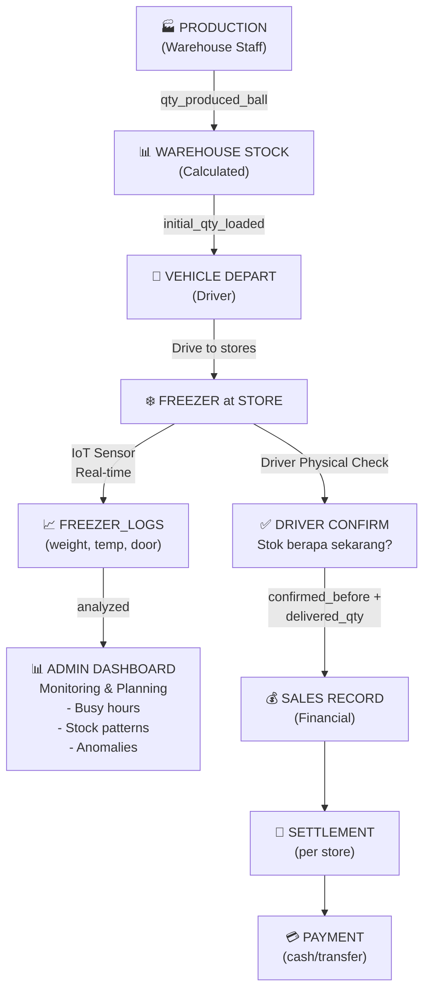

# Ice Factory Workflow Visualization

## 🔄 End-to-End Workflow



---

## 🎯 Dual Data Flow (Critical!)

```
REAL-TIME MONITORING (Untuk Planning)
┌─────────────────────────────────────────────────────────┐
│ IoT Sensor                                              │
│ ├─ Load Cell (weight)                                  │
│ ├─ Thermometer (temperature)                           │
│ └─ Door Sensor (open/close)                            │
└─────────────┬───────────────────────────────────────────┘
              │
              ↓ (Every event change)
┌─────────────────────────────────────────────────────────┐
│ FREEZER_LOGS Table                                      │
│ ├─ freezer_id                                           │
│ ├─ weight_kg                                            │
│ ├─ temperature_c                                        │
│ ├─ door_status                                          │
│ └─ logged_at (timestamp)                               │
└─────────────┬───────────────────────────────────────────┘
              │
              ↓ (Calculate estimated stock)
┌─────────────────────────────────────────────────────────┐
│ ADMIN DASHBOARD                                         │
│                                                         │
│ "RSA-001 Freezer (Toko A):"                            │
│ ├─ Last weight: 25 kg                                  │
│ ├─ Tare: 15 kg                                         │
│ ├─ Net: 10 kg                                          │
│ ├─ Estimated stock: 1 ball                             │
│ ├─ Max capacity: 10 ball                               │
│ ├─ Suggested delivery: 9 ball ✅                        │
│ ├─ Last 4 hours: 2 weight changes                      │
│ │  └─ Jam 12-2PM sering ada door open (busy hour)   │
│ └─ Last temp: 18°C ✅                                  │
│                                                         │
│ ACTION: "Plan kirim RSA-001 jam 10AM sebelum ramai"   │
└─────────────────────────────────────────────────────────┘
```

```
FINANCIAL RECORD (Driver Confirmation)
┌─────────────────────────────────────────────────────────┐
│ Driver ARRIVAL at Store                                 │
│                                                         │
│ TIDAK lihat FREEZER_LOGS!                               │
│ Driver cek FISIK:                                       │
│ ├─ "Stok sekarang berapa ball?"                        │
│ └─ Driver lihat di freezer → "Terlihat ada 2 ball"    │
└─────────────┬───────────────────────────────────────────┘
              │
              ↓ (Confirm or override)
┌─────────────────────────────────────────────────────────┐
│ DELIVERY_ITEMS Record Created                           │
│ ├─ delivery_id: D-001                                  │
│ ├─ freezer_id: FRZ-001                                 │
│ ├─ confirmed_stock_before_ball: 2                      │
│ ├─ delivered_qty_ball: 8                               │
│ └─ visited_at: 2026-08-24 10:05:30                    │
└─────────────┬───────────────────────────────────────────┘
              │
              ↓ (Auto-calculate sales)
┌─────────────────────────────────────────────────────────┐
│ SALES Record Created (Financial Source of Truth)       │
│ ├─ store_id: STR-001                                   │
│ ├─ freezer_id: FRZ-001                                 │
│ ├─ qty_ball: 8                                         │
│ ├─ unit_price: Rp 10,000                               │
│ ├─ total_amount: Rp 80,000                             │
│ ├─ status: CONFIRMED                                   │
│ └─ sold_at: 2026-08-24 10:05:30                       │
└─────────────┬───────────────────────────────────────────┘
              │
              ↓
┌─────────────────────────────────────────────────────────┐
│ SETTLEMENT (Auto-aggregate per store)                   │
│ ├─ store_id: STR-001                                   │
│ ├─ current_sales_amount: Rp 80,000 (sum all freezers)  │
│ ├─ amount_paid: Rp 0                                   │
│ ├─ outstanding: Rp 80,000                              │
│ └─ status: DRAFT                                       │
└─────────────┬───────────────────────────────────────────┘
              │
              ↓ (Driver collect payment)
┌─────────────────────────────────────────────────────────┐
│ PAYMENT Record                                          │
│ ├─ settlement_id: SET-001                              │
│ ├─ amount: Rp 80,000                                   │
│ ├─ method: CASH                                        │
│ ├─ status: CONFIRMED                                   │
│ └─ paid_at: 2026-08-24 10:07:00                       │
└─────────────────────────────────────────────────────────┘
```

---

## ⏰ Timeline Operasional (1 Hari)

```
JAM 08:00 (PRODUCTION & WAREHOUSE)
└─ Warehouse staff selesai produksi 100 ball
   ├─ Record di PRODUCTIONS table
   └─ Warehouse stock updated

JAM 08:30 (PLANNING)
└─ Admin lihat FREEZER_LOGS dari hari sebelumnya
   ├─ "RSA-001 jam 11-2PM sering laku (weight ↓ 8kg)"
   ├─ "RSA-002 stok sekarang low (0.5 ball estimate)"
   ├─ "RSA-003 suhu naik agak terik"
   └─ Planner: "OK, prioritas RSA-001 & RSA-002 pagi"

JAM 09:00 (DRIVER DEPART)
└─ Driver load 50 ball ke kendaraan
   ├─ Record: DELIVERIES.initial_qty_loaded_ball = 50
   └─ Status: PLANNED

JAM 10:00-12:00 (DELIVERY VISITS)
└─ Stop 1: Toko A (RSA-001)
   ├─ IoT saat ini: weight=18kg, tare=15kg, net=3kg
   │  (Estimated: 0.3 ball - tapi ini hanya suggestion!)
   ├─ Driver FISIK cek: "Lihat di freezer... ada 2 ball"
   ├─ Driver: confirmed_stock_before = 2
   ├─ Suggested delivery = 10 - 2 = 8
   ├─ Klik [YA] → Auto-deliver 8 ball
   ├─ Create DELIVERY_ITEMS & SALES record
   └─ Freezer sekarang: 2 + 8 = 10 ball (penuh)

└─ Stop 2: Toko B (RSA-002)
   ├─ IoT saat ini: weight=5kg, tare=15kg
   │  (Estimated: 0 ball - LOW!)
   ├─ Driver FISIK cek: "Kosong banget"
   ├─ Driver: confirmed_stock_before = 0
   ├─ Suggested delivery = 10
   ├─ Klik [YA] → Auto-deliver 10 ball
   ├─ Create DELIVERY_ITEMS & SALES record
   └─ Freezer sekarang: 0 + 10 = 10 ball (penuh)

└─ Stop 3: Toko C (RSA-003)
   ├─ IoT saat ini: weight=30kg, tare=15kg, net=15kg
   │  (Estimated: 1.5 ball)
   ├─ Driver FISIK cek: "Ada 3 ball"
   ├─ Driver: Klik [TIDAK] (override IoT estimate)
   ├─ Driver input manual: confirmed_stock_before = 3
   ├─ Suggested delivery = 10 - 3 = 7
   ├─ Klik [YA] → Auto-deliver 7 ball
   └─ Freezer sekarang: 3 + 7 = 10 ball (penuh)

JAM 12:05 (PAYMENT)
└─ Driver settle dengan 3 toko:
   ├─ Toko A: Rp 80,000 (8 ball × Rp 10,000) → Driver terima dari toko
   ├─ Toko B: Rp 100,000 (10 ball × Rp 10,000) → Driver terima
   ├─ Toko C: Rp 70,000 (7 ball × Rp 10,000) → Driver terima
   └─ Total collected: Rp 250,000 ✅
      (Initial load: 50 ball × Rp 10,000 = Rp 500,000)
      (Sisa: 50 - (8+10+7) = 25 ball)

JAM 12:30 (DELIVERY COMPLETED)
└─ Driver masuk DELIVERIES.status = COMPLETED
   ├─ Driver pulang/lanjut rute lain
   └─ 25 ball sisa kembali ke warehouse

JAM 18:00 (ADMIN DASHBOARD UPDATED)
└─ Real-time dashboard menunjukkan:
   ├─ Daily Revenue: Rp 250,000 (dari 3 toko)
   ├─ Collections: Rp 250,000
   ├─ Outstanding: Rp 0
   ├─ Freezer A: 10 ball (full, last restock 10:05)
   ├─ Freezer B: 10 ball (full, last restock 10:30)
   ├─ Freezer C: 10 ball (full, last restock 10:50)
   └─ Tomorrow plan: "Fokus RSA-004 & RSA-005, estimate sibuk jam 1-4PM"

JAM 12:00-18:00 (NEXT 6 HOURS - REAL-TIME MONITORING)
└─ IoT FREEZER_LOGS terus record setiap perubahan:
   ├─ Freezer A: weight ↓ 8kg (laku 0.8 ball)
   │  ├─ Jam 12:30: door open 2x (busy)
   │  ├─ Jam 14:00: weight turun terus
   │  └─ Trend: "Freezer A laku faster than expected"
   │
   ├─ Freezer B: weight ↓ 3kg (laku 0.3 ball)
   │  └─ Trend: "Freezer B slow sales, toko B kurang ramai"
   │
   └─ Freezer C: weight ↓ 2kg (laku 0.2 ball)
      └─ Trend: "Freezer C steady, tidak ada anomali"

JAM 23:59 (END OF DAY)
└─ FREEZER_LOGS tersimpan untuk historical analysis
   ├─ Dashboard: "Pattern hari ini: RSA-001 laku cepat, butuh visit 2x"
   ├─ Suggestion: "Besok RSA-001 schedule pagi jam 9AM & sore jam 4PM"
   └─ Planner set DELIVERIES besok dengan optimized timing
```

---

## 🧠 Key Mental Model

```
┌───────────────────────────────────────────────────────────────────┐
│ FREEZER_LOGS (IoT Real-time Sensor)                              │
│ ═══════════════════════════════════════════════════════════════════│
│ Tujuan: PLANNING & OPERATIONAL INTELLIGENCE                       │
│ - Detect jam ramai (door buka, weight turun)                     │
│ - Predict next delivery timing                                    │
│ - Detect anomali (suhu aneh, door stuck)                         │
│ - NOT untuk financial record                                      │
│ - Driver TIDAK perlu lihat ini saat delivery                     │
│ - Accuracy: ~90% (edge case ada)                                 │
└───────────────────────────────────────────────────────────────────┘

┌───────────────────────────────────────────────────────────────────┐
│ DASHBOARD (Admin/Planner View)                                    │
│ ═══════════════════════════════════════════════════════════════════│
│ Input: FREEZER_LOGS data                                          │
│ Output: Actionable insights                                       │
│ - "Freezer X recommended delivery time: 10 AM"                    │
│ - "Freezer Y busy hours: 12-2PM (weight -5kg/2hrs)"              │
│ - "Freezer Z anomali: suhu 25°C (alert!)"                        │
│ Decision: Optimize delivery schedule                              │
└───────────────────────────────────────────────────────────────────┘

┌───────────────────────────────────────────────────────────────────┐
│ DRIVER DELIVERY (Physical Confirmation)                           │
│ ═══════════════════════════════════════════════════════════════════│
│ Input: Freezer FISIK observation                                  │
│ Process: Driver lihat & confirm stok                              │
│ Output: SALES record (financial source of truth)                  │
│ - Confirmed stock before                                          │
│ - Delivered qty                                                   │
│ - Accuracy: 100% (human confirmation)                             │
│ - These become permanent financial records                        │
└───────────────────────────────────────────────────────────────────┘
```

---

## 💡 Contoh Perbedaan: IoT Estimate vs Driver Confirmation

```
SCENARIO: Freezer A sama Freezer B, pagi jam 9 AM

FREEZER A (IoT Estimate) vs (Driver Check):
├─ IoT: weight=20kg, tare=15kg, net=5kg
│  └─ Estimated stock: 0.5 ball (bisa salah)
├─ Driver: Lihat freezer FISIK → "Ada 2 ball"
│  └─ Driver confirm: 2 ball (100% akurat)
├─ Delivered: 8 ball
└─ SALES record: qty=8, price per ball, total amount (FINAL!)

FREEZER B (IoT Spot On):
├─ IoT: weight=15kg, tare=15kg, net=0kg
│  └─ Estimated stock: 0 ball (akurat)
├─ Driver: Lihat freezer FISIK → "Kosong banget"
│  └─ Driver confirm: 0 ball (sama dengan IoT)
├─ Delivered: 10 ball
└─ SALES record: qty=10, price per ball, total amount (FINAL!)

KEY: Meskipun IoT kadang salah (Freezer A), driver ALWAYS konfirm
      fisik, jadi SALES record ALWAYS akurat 100% untuk accounting!
```

---

## 📊 Untuk Presentasi: 3 Layer Architecture

```
┌─────────────────────────────────────────────────────────────────┐
│ LAYER 1: OPERATIONAL INTELLIGENCE (Planning)                    │
│ ───────────────────────────────────────────────────────────────│
│ Component: IoT Sensors + FREEZER_LOGS + Dashboard               │
│ Users: Admin, Planner, Manager                                  │
│ Purpose: Smart scheduling, detect patterns, optimize delivery   │
│ Data Quality: ~90% (trend analysis, not exact)                  │
│ Example: "RSA-001 needs visit before 11 AM (busy hour starts)"  │
└─────────────────────────────────────────────────────────────────┘

┌─────────────────────────────────────────────────────────────────┐
│ LAYER 2: EXECUTION (Driver Delivery)                            │
│ ───────────────────────────────────────────────────────────────│
│ Component: Driver App + DELIVERY_ITEMS Confirmation             │
│ Users: Driver                                                   │
│ Purpose: Minimize input, maximize accuracy                      │
│ Data Quality: 100% (human confirmed)                            │
│ Example: "Confirm stok 2 ball? → Klik [YA] → Deliver 8 ball"  │
└─────────────────────────────────────────────────────────────────┘

┌─────────────────────────────────────────────────────────────────┐
│ LAYER 3: FINANCIAL RECORD (Accounting)                          │
│ ───────────────────────────────────────────────────────────────│
│ Component: SALES + PAYMENTS + SETTLEMENTS                       │
│ Users: Finance, Admin                                           │
│ Purpose: Revenue, collection, profit calculation                │
│ Data Quality: 100% (derived from confirmed delivery)            │
│ Example: "Revenue Rp 80K, Collection Rp 80K, Outstanding Rp 0"  │
└─────────────────────────────────────────────────────────────────┘
```
